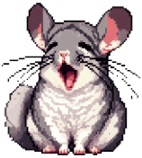
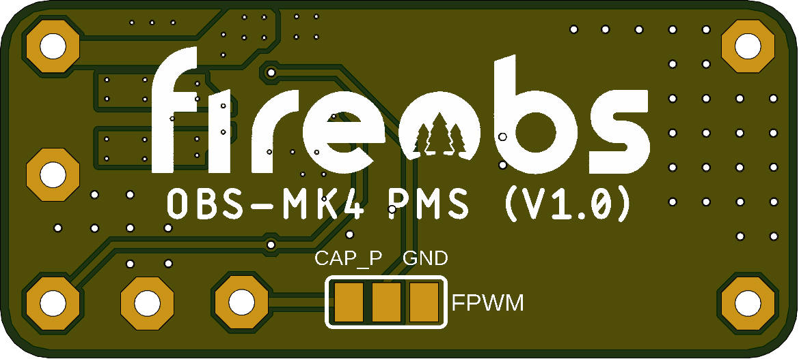

### Hey!

I'm **Daniel**, a Robotics master's student with a passion for **developing advanced robotic systems**. Besides my studies, I enjoy working with robot-centered **embedded systems** and **PCB design**.

<!--\-->
 &nbsp;&nbsp;  &nbsp;&nbsp;  &nbsp;&nbsp;  &nbsp;&nbsp;  &nbsp;&nbsp;  &nbsp;&nbsp; 

Since I joined GitHub **4** years ago, I pushed **821** commits, opened **1** issues, submitted **5** pull requests, and contributed to **3** public repos.

----

Here is a list of my **semester projects**:
- 8'th <a href="https://github.com/RoboticsAAU/hand_prosthesis_rl_control_pkgs.git">Reinforcement Learning on Hand Prosthesis</a>
- 7'th <a href="https://github.com/RoboticsAAU-Master/UnderwaterMapping.git">RUD-PT: A Realistic Underwater Dataset with Pose Tracking</a>
- 6'th <a href="https://github.com/RoboticsAAU/MatrixProductionV2.git">Flow Optimisation in Matrix Production Systems</a>
- 5'th <a href="https://github.com/RoboticsAAU/MatrixProduction.git">Integration of AAU Smart Lab into Matrix Production using ACOPOS 6D</a>
- 4'th <a href="https://github.com/RoboticsAAU/EchoLocalisation.git">Swarm Robotics using Echolocation for Search and Rescue in Buildings</a>
- 3'rd <a href="https://github.com/RoboticsAAU/CrustCrawler.git">Assistive Robotic Manipulator to Restore Upper Limb Functionality</a>
- 2'nd <a href="https://github.com/RoboticsAAU/Simulation-of-robot-cell-for-AAU-Smart-Lab.git">Integration of Robot Cell in AAU Smart Lab</a>
- 1'st <a href="https://github.com/Blueguardian/rob337-p1.git">3D-modelling for virtual museum experience</a>

----

Here are some of the things I've worked on as a **student assistant**:

    
    

----

Some of my **other work**:

  
  

----

<!-- -->
<!--  -->
<!--  -->

| &nbsp;&nbsp;&nbsp; Portfolio : [https://danidoro.github.io/](https://danidoro.github.io/) &nbsp;&nbsp;&nbsp;|&nbsp;&nbsp;&nbsp; Open Source Work : &#9660; &#9660; &#9660;
